# GloPM CLI - 废弃项目说明

> ⚠️ **此项目为废弃方案，从未正式发布或集成到 EggyUI 中**

## 项目背景
`glopm_cli.py` 是 **GloPM (Global Package Manager)** 生态系统的命令行工具，由 Sylphy 设计。GloPM 原本计划作为 EggyUI 生态的**资源共享中心**，用于管理主题包、组件和资源的分发。然而，由于以下原因，该项目最终被放弃：

1. **维护风险过高** - 整个系统依赖单一开发者维护
2. **技术复杂度超标** - 实现跨平台包管理需要解决大量兼容性问题
3. **安全审核困难** - 无法保证第三方包的可靠性和安全性
4. **资源限制** - 核心团队无法承担长期维护成本

## 核心功能（已废弃）

```bash
# 用户管理
glopm register     # 注册新用户
glopm login        # 用户登录
glopm logout       # 退出登录

# 包管理操作
glopm publish <包名> <版本> <描述> <文件>  # 发布新包
glopm download <包名>[@版本][:输出路径]    # 下载包
glopm search <关键词>                   # 搜索包
glopm delete <包名>                     # 删除包

# 批量操作
glopm batch-download 包1 包2...       # 批量下载
glopm batch-delete 包1 包2...         # 批量删除

# 系统管理
glopm config --show                  # 查看配置
glopm clear-cache                    # 清除缓存
glopm delete-account                 # 删除账户
```

## 技术架构



## 废弃原因详解

| 问题类型       | 具体挑战                                                                 |
|----------------|--------------------------------------------------------------------------|
| **安全风险**   | 无法有效审核第三方包内容，存在恶意代码注入风险                           |
| **维护成本**   | 需要持续维护API服务器和审核团队，超出志愿者团队能力范围                  |
| **技术债务**   | 易语言/.NET混合架构导致跨平台兼容性问题难以解决                          |
| **法律风险**   | 分发《蛋仔派对》衍生素材可能涉及版权问题                                 |
| **生态规模**   | EggyUI用户基数不足以支撑包管理生态的良性循环                            |

## 历史意义
虽然 GloPM 最终未能落地，但其设计理念为 EggyUI 提供了重要启发：
1. 催生了安全的**离线素材分发机制**
2. 确立了**组件签名验证**的基础规范
3. 推动了**本地化素材缓存**系统的开发
4. 验证了**按需加载**架构的可行性

> "GloPM 代表了我们最雄心勃勃的构想，但也教会了我们务实的重要性。  
> 有些星星注定要在地平线上闪耀，而不是握在手中。"  
> —— Sylphy (GloPM 概念设计者)