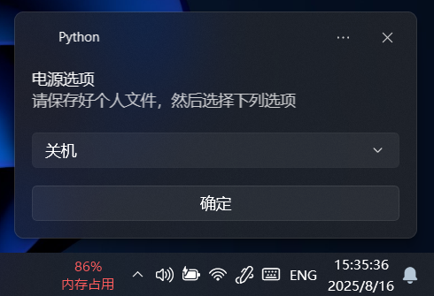

# EggyUI 电源控制组件

> **组件状态**：`已弃用` · 仅用于 EggyUI 1.0-2.0 版本

## 功能说明
```python
from win11toast import toast
import os
# 创建电源选项弹窗
rt1 = toast('电源选项', '请保存好个人文件，然后选择下列选项', 
           selection=['关机', '重启', '休眠'], 
           button='确定', 
           duration='long')

# 根据用户选择执行对应命令
if str(rt1) == "{'arguments': 'http:确定', 'user_input': {'selection': '关机'}}":
    os.system("shutdown -s -t 0")  # 立即关机
elif str(rt1) == "{'arguments': 'http:确定', 'user_input': {'selection': '重启'}}":
    os.system("shutdown -r -t 0")  # 立即重启
elif str(rt1) == "{'arguments': 'http:确定', 'user_input': {'selection': '休眠'}}":
    os.system("shutdown -h")       # 进入休眠
```


## 实现历史
| 版本       | 实现方式           | 状态   |
|------------|--------------------|--------|
| EggyUI 1.0-2.0 | 打包为独立EXE | ✅ 使用 |
| EggyUI 2.5 | 完全移除           | ❌ 弃用 |

## 核心问题
### 性能瓶颈

- **启动延迟**：完整流程耗时 3-5 秒
- **资源占用**：打包后EXE体积达 15MB+（含Python运行时）
- **响应迟钝**：弹窗出现有明显延迟感

## 替代方案
EggyUI 2.5+ 采用微软原生组件实现：
```batch
:: 使用系统原生滑动关机组件
start slidetoshutdown.exe
```
**优势对比**：

| 指标          | Python实现 | slidetoshutdown |
|---------------|------------|-----------------|
| 启动时间      | 3000-5000ms| 200ms           |
| 内存占用      | 50MB+      | <10MB           |
| 系统兼容性    | Win10/11   | Win8.1+         |
| 视觉效果      | 基础Toast  | 原生滑动动画    |

## 开发者信息
- **作者**：BSOD-MEMZ (EggyUI 创始人)
- **开发时期**：2024年第三季度
- **遗留价值**：作为EggyUI早期探索Win11通知系统的技术验证